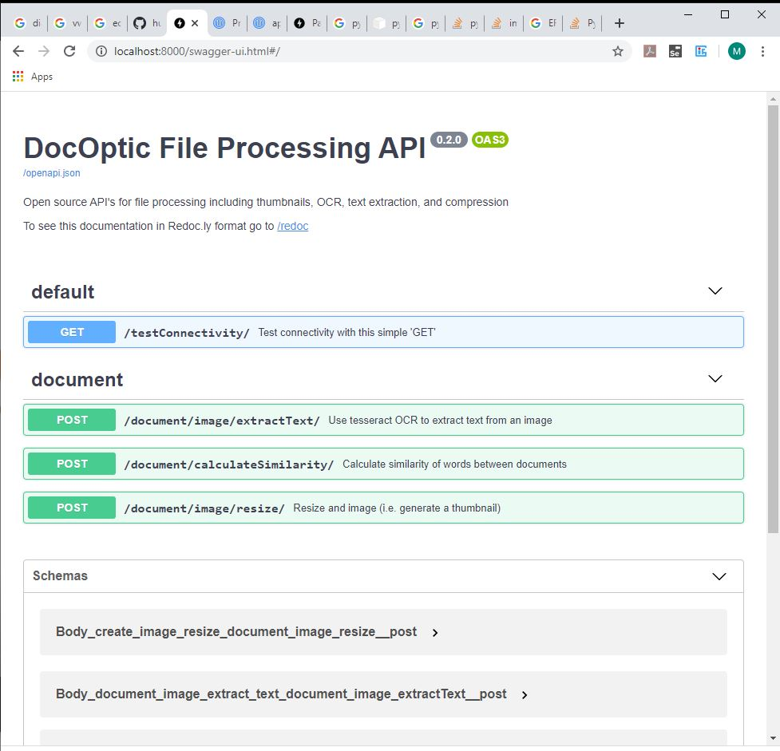

# DocOptic File API


## Table of Contents
* [Overview](#overview)
* [Installation & Setup](#installation-and-setup)
* [TODO's](#todos)
* [Verify Installation is Running](#verify-installation-is-running)

--------------------------------------------------------
<a name="overview"></a>
# Overview
Open source API's for file processing including thumbnails, OCR, text extraction, and compression


--------------------------------------------------------
<a name="installation-and-setup"></a>
# Installation & Setup

## Install tesseract-ocr (Optical Character Recognition)
Follow the installation instructions here: https://github.com/tesseract-ocr/tesseract/wiki

After installing tesseract, you will need to add it to your %PATH% environment variable. 

Check to ensure tesseract is installed:
```bash
 tesseract --version
```


## Install pip requirements
several python packages are utilized in Docoptic, run them with the following command:
```bash
 pip install -r requirements.txt
```


--------------------------------------------------------
<a name="todos"></a>
# TODO's

## pdf2Image install
For "pip install pdf2image" we  have to install poppler on windows/linux machines.  maybe with conda?  linux uses poppler-utils. More info here: https://pypi.org/project/pdf2image/

## nltk download stopwords
code does this: nltk.download('stopwords') which will fail with proxy (nltk.set_proxy('http://proxy.example.com:3128', ('USERNAME', 'PASSWORD')) )
https://www.nltk.org/data.html#command-line-installation

## tesseract and pytesseract install
need to install pyteseeract. this sits on the tesseract in %PATH% which is native to windows/linux


--------------------------------------------------------
<a name="verify-installation-is-running"></a>
# Verify Installation is Running
## start the application 
use command 
```bash
   uvicorn main:app --reload
```
***don't use --reload for production, its purely for development so we don't need to restart with every code change***

alternatively, you can run command "python main.py" but this will not take advantage of the threading/async ASGI of uvicorn.  This command is useful for testing though


## verify it is running
open up your webrowser to http://localhost:8000 and see the api. 


## try out each of the API's
Python is an intrepreted language.  Hence, we don't actually know our install is successful until we execute each of these:
* /testConnectivity/ 
  * makes sure we can at lest ***connect***
* /document/image/extractText/ 
  * verifies ***tesseract*** is installed
* /document/image/calculateSimilarity/ 
  * verifies ***pdf2Image*** to image is installed.  
  * ***Note:*** please test this with a ***.jpg*** and a ***.pdf*** since they use different libraries. if jpeg works, we know all the pip requirements are ok.  The issue is in the binary for pdf2Image if pdf fails but jpg works.
* /document/image/calculateSimilarity/ 
  * verifies ***nltk*** was able to download the stopwords and run machine learning with scikit-learn

## cool... right?

